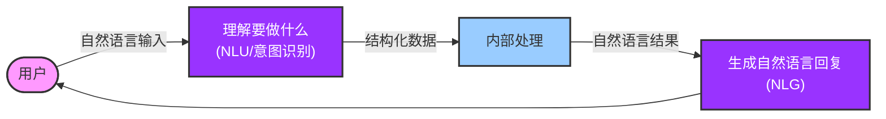

# 推荐流量包的智能客服

把大模型用于软件系统的核心思路：
1. 把输入的自然语言对话，转成**结构化**的信息（NLU, Natural Language Understanding, 自然语言理解）
2. 用传统软件手段处理结构化信息，得到处理策略
3. 把策略转成自然语言输出（NLG, Natural Language Generation, 自然语言生成）

## 系统流程图



## 代码结构

本项目包含四个主要实现：

### 1. func_demo.py - 函数式编程实现

简化版实现，使用函数式编程风格，主要功能：
- 使用OpenAI API进行单次对话和多轮对话处理
- 将用户自然语言输入转换为结构化JSON格式
- 包含模块化的函数设计

### 2. advisor.py - 面向对象实现

完整版实现，采用面向对象设计，包含以下核心组件：
- **NLU类**：负责自然语言理解，将用户输入转换为结构化语义
- **DST类**：对话状态跟踪，维护多轮对话状态
- **MockedDB类**：模拟数据库，存储套餐信息并提供检索功能
- **DialogManager类**：对话管理，协调各组件并生成回复

### 3. chatbot.py - 简单聊天机器人实现

简化版聊天机器人，直接使用OpenAI API进行多轮对话：
- 维护对话历史
- 支持交互式对话
- 提供友好的用户界面

### 4. utils.py - 公共工具模块

包含共享的常量、函数和配置：
- OpenAI API调用
- 指令和输出格式定义
- 示例数据

## 使用方法

### 环境配置

1. 安装依赖：
```bash
pip install -r requirements.txt
```

2. 配置环境变量：
创建`.env`文件，添加以下内容：
```
OPENAI_API_KEY=你的OpenAI API密钥
OPENAI_BASE_URL=可选的API基础URL
```

### 运行示例

运行函数式实现：
```bash
python func_demo.py
```

运行面向对象实现：
```bash
python advisor.py
```

运行简单聊天机器人：
```bash
python chatbot.py
```

## 功能特点

- 支持单轮对话和多轮对话
- 精确识别用户对流量套餐的需求（价格、流量大小、套餐类型）
- 支持排序需求（如"最便宜的"、"流量最大的"）
- 多轮对话中保持上下文连贯性
- 提供多种实现方式，适合不同场景和学习需求
